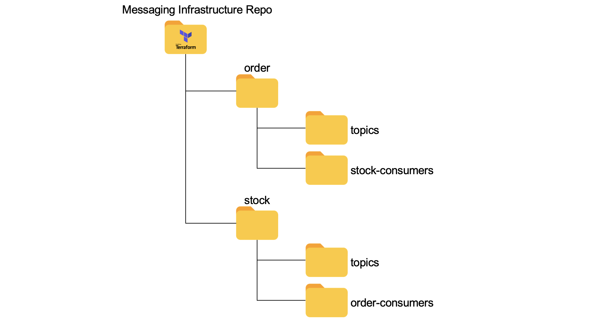

ifdef::env-github[]
:tip-caption: :bulb:
:note-caption: :information_source:
:important-caption: :heavy_exclamation_mark:
:caution-caption: :fire:
:warning-caption: :warning:
endif::[]

= AWS SNS + SQS PoC
:toc:

== What we will build
image:poc-image.png[poc, title="poc"]

== Pre work 

.AWS CLI, Serverless Framework and Terraform
[%collapsible]
====

Install AWS CLI according to your operating system using this https://docs.aws.amazon.com/cli/latest/userguide/cli-chap-install.html[link].

If you don't have an IAM user follow *step A*, otherwise if you need to create only access keys for an existing user follow *step B*.

.A. Creating an IAM user and access keys 

*	Sign in to the AWS Management Console and open the https://console.aws.amazon.com/iam/[IAM console].
*	In the navigation pane, choose *Users* and then choose *Add* user.
*	Type the user name for the new user, select *Programmatic access* and *AWS Management Console access* 
**	For *Console password*, choose *Autogenerated password*. You can view or download the passwords when you get to the Final page.
**	Select *Require password reset*.
**	Click *Next: Require password reset*.
*	Select *Attach existing policies directly*, choose *AdministratorAccess*,
*	Click *Next: Tags*, *Next: Review* and *Create User*.
*	To view the users' *access keys* (access key IDs and secret access keys), choose *Show* next to each password and access key that you want to see. To save the access keys, choose *Download .csv* and then save the file to a safe location.

.B. Creating access keys for an existing IAM user

*	Sign in to the AWS Management Console and open the https://console.aws.amazon.com/iam/[IAM console].
*	In the navigation pane, choose *Users* and then choose the  existing user you want to create the access keys.
*	Under the *Security credentials* pane, in the section *Access keys* click *Create access key*
*	Type the user name for the new user, select *Programmatic access* and *AWS Management Console access* 
*	To view the users' *access keys* (access key IDs and secret access keys), choose *Show* next to *Secret access key*. To save the access key, choose *Download .csv* and then save the file to a safe location.

After installing AWS CLI and getting your access keys run this command to quickly set your AWS credentials, region and output format (default:json)
 
	$ aws configure

.Installing Node.js 

Serverless is a Node.js CLI tool so the first thing you need to do is to install Node.js on your machine.

Go to the official Node.js website, download and follow the installation instructions to install Node.js on your local machine.

Note: Serverless runs on Node v6 or higher.

You can verify that Node.js is installed successfully by running `node --version` in your terminal. You should see the corresponding Node version number printed out.

.Installing the Serverless Framework

Next, install the Serverless Framework via npm which was already installed when you installed Node.js.

Open up a terminal and type `npm install -g serverless` to install Serverless.

	$ npm install -g serverless

Once the installation process is done you can verify that Serverless is installed successfully by running the following command in your terminal:

	$ serverless

To see which version of serverless you have installed run:

	$ serverless --version

.Install Terraform (this project uses Terraform 0.12.28)

	$ brew install terraform

====

== Messaging infraestructure directory

The https://github.com/joaovitorsramos/aws-sns-sqs-poc/tree/master/messaging-infrastructure[messaging-infrastructure] directory contains the necessary Terraform files for provisioning the topics and the Queues.

TIP: To have publishers and consumers fully decoupled from each other, ideally the publisher should know only about the topic (not the queues), and the consumers should know only about the queues (not the topic). Therefore, creating the topic and queues should not be responsibility of publishers and consumers. In that case, topic and queues will be created beforehand using Terraform.

The https://github.com/joaovitorsramos/aws-sns-sqs-poc/tree/master/messaging-infrastructure[messaging-infrastructure] directory is divided into folders of *resource owners*. In this example, `Order Service` is responsible for publishing messages to `orderCreated` topic, therefore, the creation of this topic is in a Terraform file inside order folder. 

The same applies for the `stockConsumerForOrderCreated` queue.  `Stock Service` is responsible for consuming messages from `stockConsumerForOrderCreated` queue, therefore, the creation of this queue is in a Terraform file inside stock folder. 

== Getting started

=== Create the AWS SNS topic

Inside `/messaging-infrastructure/order/topics/` run the following commands to create a Terraform Workspace and a new topic `orderCreated`

	$ terraform init
	$ terraform workspace new qa-order-topics
	$ terraform apply

=== Create the AWS SQS queus 

Inside `/messaging-infrastructure/order/topics/` run the following commands to create a Terraform Workspace and a new queue `stockConsumerForOrderCreated`

	$ terraform init
	$ terraform workspace new qa-stock-order-consumers
	$ terraform apply

=== Create the lambda function 

Inside `/lambda-orderConsumer/` run the

	$ sls deploy

=== Run the java microservices 

Inside the folders `/microservices/order/` and `/microservices/stock/` run

	$ mvn spring-boot:run	

== Testing

=== Publishing and subscribing to messages 

Fill the stock with itens to approve the order

	$ curl --location --request PUT 'http://localhost:8081/stock' \
	--header 'Content-Type: application/json' \
	--data-raw '{
			"sku": "123_aspirin",
			"amount": "100",
			"branchId": "1212"
		}'

	$ curl --location --request PUT 'http://localhost:8081/stock' \
	--header 'Content-Type: application/json' \
	--data-raw '{
			"sku": "456_ibuprofen",
			"amount": "200",
			"branchId": "1212"
		}'

Create and order

	$ curl --location --request POST 'http://localhost:8080/orders' \
	--header 'Content-Type: application/json' \
	--data-raw '{
			"orderId": "3333",
			"customerId": "11111",
			"walletId": "101010",
			"orderItems":[
				{
				"sku": "123_aspirin",
				"amount": "10",
				"branchId": "1212",
				"cost": "100"
				},{
				"sku": "456_ibuprofen",
				"amount": "10",
				"branchId": "1212",
				"cost": "50"
				}
			]
		}'

Check the CloudWatch log events of the lambda functions to see the printed order.

Check that the stock of ibuprofen is 190, since the order reserved 10 itens (it is possible to see in the logs of `stock` service that the order was processed and the stock was updated):

	$ curl --location --request GET 'http://localhost:8081/stock/456_ibuprofen'

=== Error handling with the deadletter queue

Stop the `stock service`

Create and order

	$ curl --location --request POST 'http://localhost:8080/orders' \
	--header 'Content-Type: application/json' \
	--data-raw '{
			"orderId": "4444",
			"customerId": "11111",
			"walletId": "101010",
			"orderItems":[
				{
				"sku": "123_aspirin",
				"amount": "10",
				"branchId": "1212",
				"cost": "100"
				},{
				"sku": "456_ibuprofen",
				"amount": "10",
				"branchId": "1212",
				"cost": "50"
				}
			]
		}'

AWS SNS wont be able to deliver the message to its consumer since the service is not running. Therefore, after the configured retries, the message will be delivered to its deadletter queue (it is possible to check the message in the AWS console in `stockConsumerForOrderCreated_DLQ`)

== Cleaning up
=== Delete infrastructure and lambda function

Run 

	$ terraform destroy
	$ sls remove

